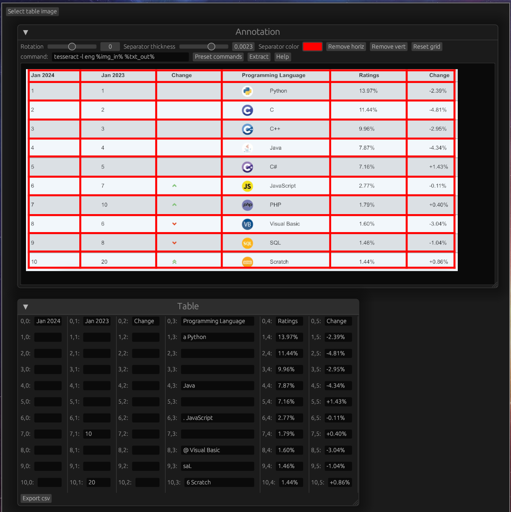

# Table OCR

A simple table OCR approach in rust, preserving structure, with a manually adjustable table/grid stencil.

Extraction quality will mostly depend on chosen OCR backend, which processes each grid section independently and in parallel. 
This backed can be changed.

Example input from [techrepublic](https://www.techrepublic.com/article/tiobe-index-language-rankings/).

